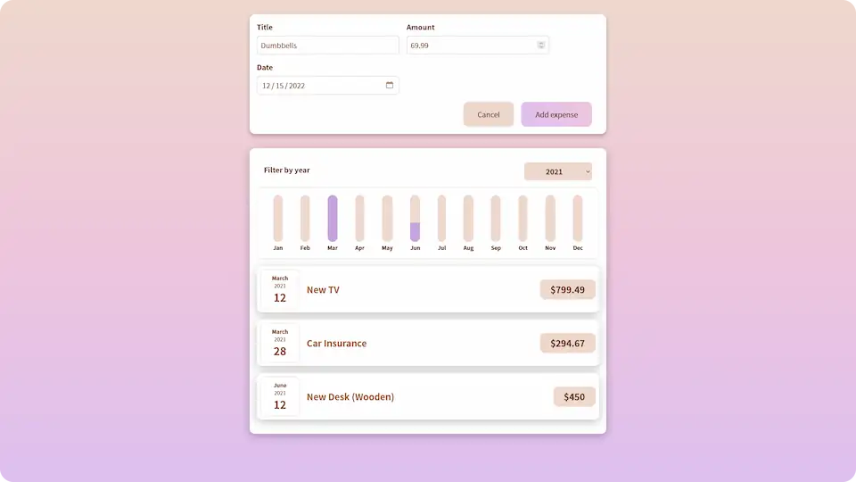

# 💸 React Expenses Tracker

**Simple demo expenses tracker made in React.**

## 💻 Screenshot

## 🛠️ Tools and technologies
`React` `CSS modules` `Create React App` `VS Code`

## 🌐 Deployment
Deployed on `Netlify`.

Live preview at [saitama-react-expenses-tracker.netlify.app](https://saitama-react-expenses-tracker.netlify.app/).

## 🎓 Related course
This project was created as a part of the [Udemy](https://www.udemy.com/ 'Udemy') course [_React - The Complete Guide (incl Hooks, React Router, Redux)_](https://www.udemy.com/course/react-the-complete-guide-incl-redux/ 'See this course on Udemy') by [Maximilian Schwarzmüller](https://twitter.com/maxedapps 'Maximilian Schwarzmüller on Twitter').

By preparing this project I learned basic **React features**.
